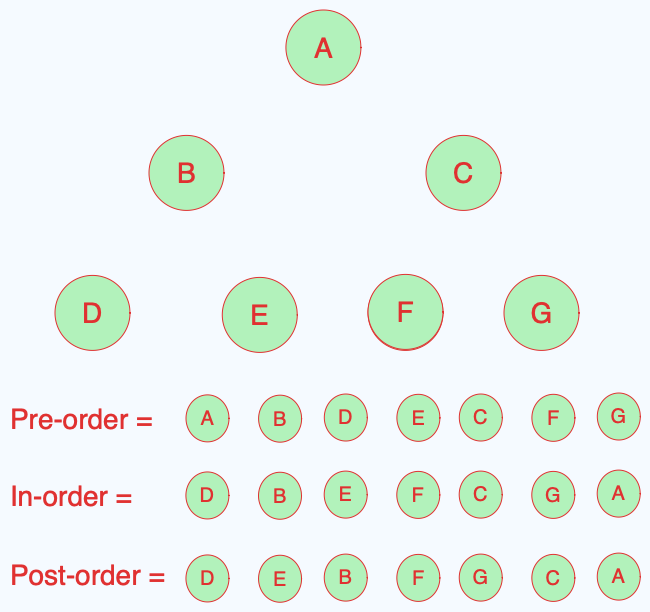

## DFS (DEPTH FIRST SEARCH)

# What is DFS ?

Depth First Search (DFS) is an algorithm used for traversing or searching tree or graph data structures. It starts at the root (selecting some arbitrary node as the root in the case of a graph) and explores as far as possible along each branch before backtracking (go deep and back)

# When to use DFS?

- We know that the node is deep inside the three DFS might be the best option
- best to anwers "does the path exist"

# three type DFS

- Pre-Order
- In-Order
- Post-Order

# Pros Vs Cons

Pros

- less memory

Cons

- can get slow when the tree is kinda deep
