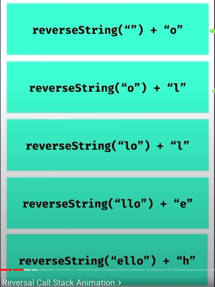
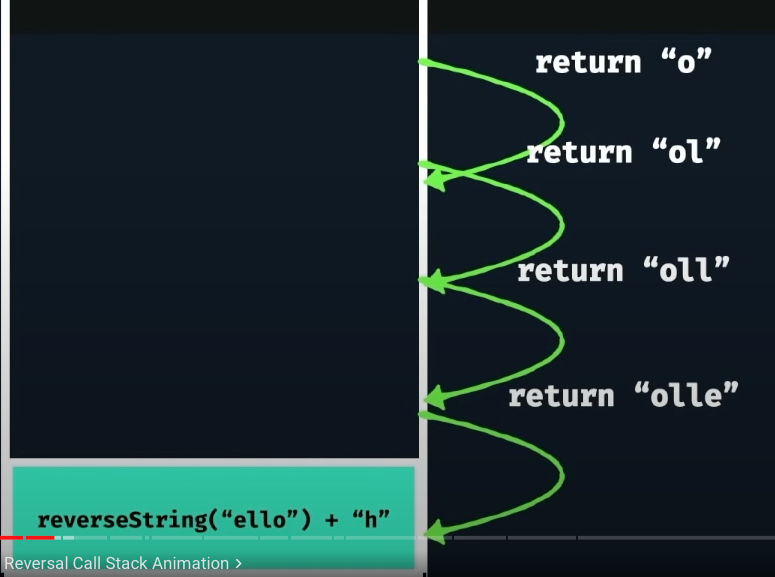

# Reverse a String

## Example 1

Input: n = "work"<br>
Output: "krow"<br>

## Example 2

Input: n = "i am working"<br>
Output: gnikrow ma i<br>

## 1 St Approach

- what is the base case
- what is the smallest amount of work i can do in each iteration

```javascript
function reverseString(s) {
  // What is the base case
  // What is the smallest amount of work i can do each iteration?
}
```

---

## 2nd Approach

when we want to find the base cases i typically think if i were just to pass a very a small input, what is the smallest input that i could just pass in to start. In this condition is an empty string. So if i pass the empty string, it would make sense that it will return back.

```javascript
function reverseString(s) {
  if (s === "") {
    return s;
  }
  // What is the smallest amount of work i can do each iteration?
}
```

---

## 3rd Approach

Whats the smallest unit of work i can do to contribute to the goal.
we take the first character from the input string and we concatenate after the recursive call.

```javascript
function reverseString(s) {
  if (s === "") {
    return s;
  }
  return reverseString(s.slice(1)) + s[0];
}
```

---

# the visual of the code

when the call stack is full



when the call stack is almost empty


